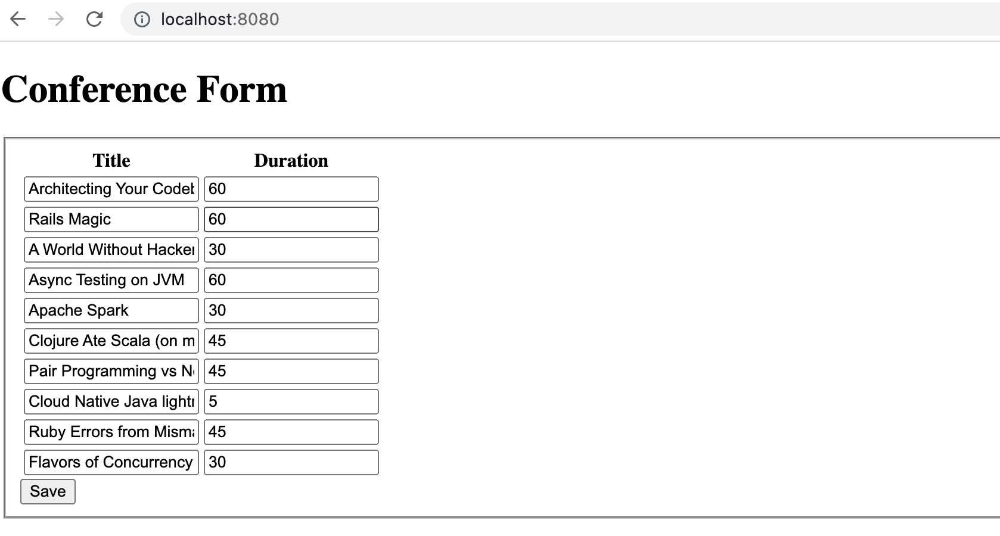
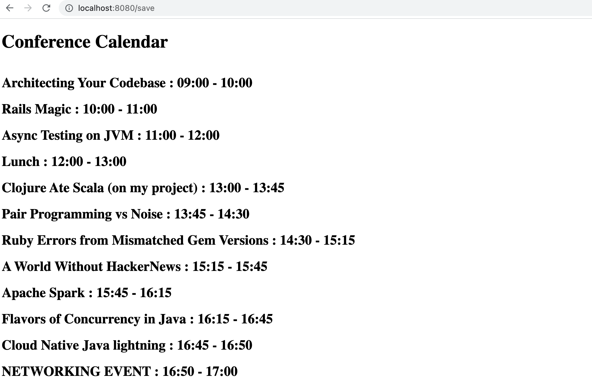

# scheduler-app

Conference Scheduler

- Simple conference scheduler project

Tech Stack:
- Spring Boot
- JDK 11
- Maven
- Spring Boot - Thymeleaf & HTML

1-) git clone https://github.com/sselinkurt/scheduler-app.git

2-) Open the project on your favorite IDE and run the SchedulerAppApplication

3-) Go to http://localhost:8080 , submit the form and see the results.

***Form Page Example:***

***Result Page Example:***

